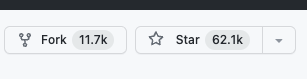
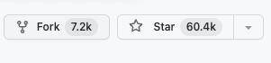
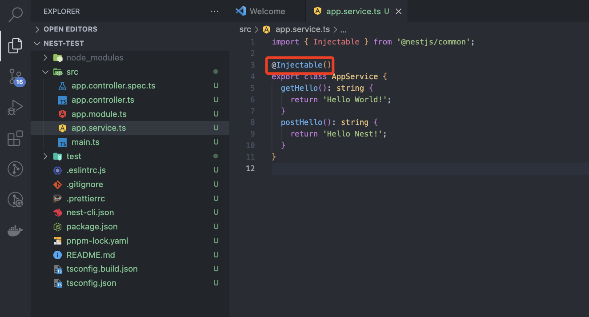
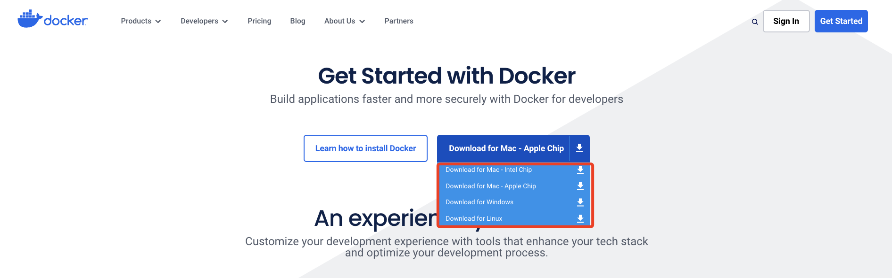
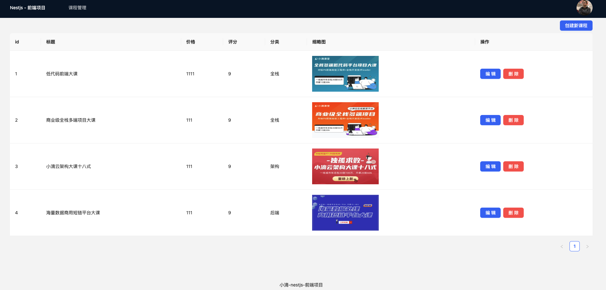

### 第一章 新一代Node框架-NestJS入门到项目实战课程介绍

#### 第1集 Nestjs 框架课程介绍+适合人员+学后水平

**简介：课程介绍、适合人员和学后水平**

- 适合人群

  - 前端工程师=>全栈｜高级

  - 后端工程师

  - 测开工程师

     

- 岗位需求


- 学后水平

  - 全方位讲解 Nestjs 全家桶：脚手架|装饰器|提供者|处理器|拦截器|DTO
  - 实现 RESful API+TypeORM+Mysql+实体和数据库数据同步
  - 详解 Nestjs JWT 权限校验+自定义依赖注入+全局依赖注入
  - 通过 React+第三方组件库Ant-Design+TailwindCSS 开发前端页面
  - 前后端联调实现 Nestjs 的增删改查接口+用户注册登录功能

  

   

- 项目实战和代码演示

  

   

- 学习形式

  - 视频讲解+文字笔记+代码分析+交互流程图
  - 配套源码 + 笔记 + 课程软件 + 技术交流群 + 答疑


#### 第2集 课程章集目录速览

**简介：课程章集目录速览**

- 课程章集目录速览


#### 第3集 Nestjs 的基本介绍

**简介：走进 Nestjs 的世界**


- Nestjs 

  - 官网
    - 中文官网：https://docs.nestjs.cn/
    - 英文官网：https://nestjs.com/

  - 介绍
    - 是一个用于构建高效，可扩展的 Node.js 服务器端应用程序的框架。
    - 它使用渐进式 JavaScript，内置并完全支持 TypeScript（但仍然允许开发人员使用纯 JavaScript 编写代码）并结合了 OOP（面向对象编程），FP（函数式编程）和 FRP（函数式响应编程）的元素
    - Nestjs 框架基于 Express 和 Fastify（速度最快的 web 框架之一）


- 为什么要使用 Nestjs 框架？

  - 热度

    - Nestjs 是所有 node 框架中发布最晚（2017年11月发布），也是在 github 中 star 增长最快的 typescript 后端框架，star 数量仅次 老牌框架 express

      - express

        

      - Nestjs

        

  - 可伸缩性

    - NestJS 支持模块化的架构设计，使得应用程序的组织和拆分变得更加容易。它提供了依赖注入（DI）和控制反转（IOC）的功能，使得模块之间的解耦和测试变得更加简单，从而提高了应用程序的可伸缩性。
      - 控制反转（IOC）：降低各个模块之间的耦合度，是一种思想
      - 依赖注入（DI）：是控制反转的一种实现

  - 完美支持 typescript

    - NestJS 是基于 TypeScript 开发的，它充分利用了 TypeScript 提供的静态类型检查和丰富的面向对象特性。这提供了更好的代码可读性、维护性和可扩展性。

  - 强大的中间件支持

    - NestJS 提供了丰富的中间件支持，包括路由中间件、异常处理中间件、身份验证中间件等。这使得开发人员能够轻松地添加和定制中间件，以满足不同的应用程序需求。

  - 兼容性

    - NestJS 是基于 Express.js 构建的，因此可以与许多现有的 Express 中间件和库无缝集成。同时，NestJS 的模块化设计也使得各种第三方库和插件的集成变得更加简单。


- 哪些公司项目使用了 Nestjs
  - 阿里云函数计算
  - 京东金融
  - 滴滴出行
  - 蚂蚁金服
  - ...


	
				**愿景："让编程不再难学，让技术与生活更加有趣"**

**更多课程请访问 xdclass.net**

### 第二章 初来乍到-走进 Nestjs 的世界

#### 第1集 Nestjs 环境搭建和项目创建

**简介：Nestjs 环境搭建和项目创建**

- 确保电脑安装了 Nodejs

  - 查看

    ```
    node -v
    v18.18.0
    ```

  - node 官网：https://nodejs.org/en


- pnpm 包管理工具

  - Node18 版本自带有 pnpm

    ```
    pnpm -v
    8.6.12
    ```

  - 如果没有的可以下载

    ```
    npm install -g pnpm
    ```

    

- 使用 Nest Cli 创建项目

  - 安装脚手架

    ```
    pnpm i -g @nestjs/cli
    ```

  - 创建新 Nestjs 项目

    ```
    nest new project-name
    
    project-name 项目的名称
    ```


#### 第2集 Nestjs 初始化目录结构介绍

**简介：Nestjs 初始化目录结构介绍**

- 结构目录

  

- 各个文件介绍

  ```
  - node_modules   ——放置项目的依赖文件
  
  - src            ——放置开发的代码文件
  
  	- app.controller.spec.ts	   ——测试 app.controller.ts 文件的单元测试文件
  	
  	- app.controller.ts				——根控制器文件，处理路由的请求和定义路由处理器
  	
  	- app.module.ts						——根模块文件，Nest 应用的主要入口
  	
  	- app.service.ts					——根服务文件，用于处理根控制器中的业务逻辑
  	
  	- main.ts									——应用程序的入口文件，用于初始化和启动 Nest 应用
  
  - test        	 ——测试文件，用于编写应用程序的单元测试和集成测试
  
  	- app.e2e-spec.ts					——编写和运行 E2E 测试的测试规范文件
  	
  	- jest-e2e.json						——Jest 的 E2E 测试配置文件
  
  - eslintrc.js    ——eslint配置文件
  
  - .gitignore     ——git忽略文件
  
  - prettierrc     ——prettier配置文件
  
  - nest-cli.json  ——Nest CLI的配置文件
  
  - package.json   ——定义项目的配置和依赖管理
  
  - pnpm-lock.yaml ——锁定项目的依赖包版本 
  
  - README.MD			 ——项目的说明文件
  
  - tsconfig.build.json  ——构建生产环境的额外配置文件
  
  - tsconfig.json		——TypeScript的配置文件
  ```


#### 第3集 Nestjs 提供 Get 和 Post 请求

**简介：Nestjs 提供 Get 和 Post 请求 **

- Get 请求

  - 控制器

    ```ts
    @Get('get')
    getHello(): string {
      return this.appService.getHello();
    }
    ```

  - 服务

    ```ts
    getHello(): string {
      return 'Hello World!';
    }
    ```

    

  

- Post 请求

  - 控制器

    ```ts
    @Post('Post')
    postHello(): string {
      return this.appService.postHello();
    }
    ```

  - 服务

    ```ts
    postHello(): string {
      return 'Hello Nest!';
    }
    ```


### 第三章 千里之行始于足下-详解 Nestjs 基础知识

#### 第1集 什么是装饰器和 Nestjs 中的应用

**简介：什么是装饰器和 Nestjs 中的应用**

- 装饰器

  - 类装饰器

    ```ts
    const doc: ClassDecorator = (target: any) => {
      console.log(target);
      target.prototype.name = "小滴课堂";
    };
    
    @doc
    class Xdclass {
      constructor() {}
    }
    
    const a: any = new Xdclass();
    
    console.log(a.name); // 小滴课堂
    ```

    

  - 属性装饰器

    ```ts
    const doc: PropertyDecorator = (target: any, key: string | symbol) => {
      console.log(target, key);
    };
    
    class Xdclass {
      @doc
      public title: string;
      constructor() {
        this.title = "小滴课堂";
      }
    }
    ```

    

  - 方法装饰器

    ```ts
    const doc: MethodDecorator = (
      target: any,
      key: string | symbol,
      descriptor: any
    ) => {
      console.log(target, key, descriptor);
    };
    
    class Xdclass {
      public title: string;
      constructor() {
        this.title = "小滴课堂";
      }
      @doc
      getTitle() {}
    }
    ```

    

  - 参数装饰器

    ```ts
    const doc: ParameterDecorator = (
      target: any,
      key: string | symbol | undefined,
      parameterIndex: number
    ) => {
      console.log(target, key, parameterIndex); // {} getTitle 1
    };
    
    class Xdclass {
      public title: string;
      constructor() {
        this.title = "小滴课堂";
      }
    
      getTitle(title: string, @doc length: number) {}
    }
    ```

#### 第2集 详解 Nestjs 控制器

**简介：详解 Nestjs 控制器**

- Nestjs 控制器中的装饰器

  |   装饰器    |            说明            |
  | :---------: | :------------------------: |
  | @Request()  |          请求参数          |
  | @Response() |          响应参数          |
  |   @Query    |    Get 请求直接获取参数    |
  |    @Body    |   Post 请求直接获取参数    |
  |   @Param    |      动态路由获取参数      |
  |  @Headers   |      获取 header 信息      |
  |  @HttpCode  |     控制器返回的状态码     |
  |   @Next()   | 继续处理下一个中间件或路由 |


#### 第3集 Nest Cli 常用命令提高开发效率

**简介： Nest Cli 常用命令提高开发效率**

- 查看所有快捷命令

  ```
  nest --help
  ```

  - 生成模块

    ```
    nest g mo demo
    ```

  - 生成控制器

    ```
    nest g co demo
    ```

  - 生成服务

    ```
    nest g s demo
    ```

  - 生成用户相关接口 将模块、controller、服务都创建好

    ```
    nest g res user
    ```

    

- 接口调试


#### 第4集 Nestjs RESful 风格 API 开发

**简介： Nestjs RESful 风格 API 开发**

- RESful
  - 是一种风格，不是标准也不是协议，我们也可以直接通过 get 和 post 完成接口的开发，不一定要按照这种风格


- 一般的接口

  - http://localhost:3000/api/user/register
    - 注册接口，需要在数据库增加用户信息，post 方法

  - http://localhost:3000/api/user/delete
    - 删除接口，需要在数据库删除用户信息，post 方法

  - http://localhost:3000/api/user/change
    - 修改接口，需要在数据库修改用户信息，post 方法

  - http://localhost:3000/api/user/find
    - 查询接口，需要在数据库查询用户信息，get 方法


- RESful 接口

  - http://localhost:3000/api/user

    - 查询接口，GET方法

    - 增加接口，POST方法

    - 更新接口，PUT PATCH方法

    - 删除接口， DELETE方法

  - 版本控制

    ```ts 
//   main.ts 文件
    async function bootstrap() {
				  const app = await NestFactory.create(AppModule);
				  // 版本控制
				  // app.setGlobalPrefix('api/v1'); // 全局
				  app.enableVersioning({  type: VersioningType.URI }); // 支持局部
				  // 开启跨域
				  app.enableCors();		
				  await app.listen(3000);
}

 // user文件，请求时需要加上v1/user才可以
				@Controller({
				  version: '1',
				  path: 'user',
				})		
				export class UserController {}
    ```

    
### 第四章 牛刀小试-详解 Nestjs 进阶用法

#### 第1集 如何理解 Nestjs 的提供者 Providers

**简介：如何理解 Nestjs 的提供者 Providers**

- providers
  - 可以将其视为一个服务容器，通过 providers 可以提供各种服务，也就是可重复使用的代码块，用于处理应用程序中的特定任务和逻辑
  - 在代码中就是用 @Injectable() 装饰器注释的类

- 基本用法

  - 通过 @Injectable 装饰器注释类 AppService

    

  - 在 App.module 中引入，配置 providers

    

  - 在要使用的控制器上进行注入

    

- 自定义名称

  ```ts
  import { Module } from '@nestjs/common';
  import { AppController } from './app.controller';
  import { UserService } from './app.service';
  
  @Module({
    imports: [],
    controllers: [AppController],
    providers: [{
      provide: "xdclass",
      useClass: UserService
    }]
  })
  export class AppModule 


// 使用的时候
export class UserController {
 constructor(@Inject('xdclass') private readonly userService: UserService) {}
}
  ```

  

- 自定义注入值

  ```ts
  import { Module } from '@nestjs/common';
  import { AppController } from './app.controller';
  import { AppService } from './app.service';
  
  @Module({
    imports: [],
    controllers: [AppController],
    providers: [{
      provide: "xdclass",
      useClass: AppService
    },{
      provide: "car",
      useClass: ['奔驰','宝马','奥迪']
    }]
  })
  export class AppModule {}

// 使用的时候
export class UserController {
 constructor(
	 @Inject('xdclass') private readonly userService: UserService,
	 @Inject('car') private readonly car: string
 ) {}

 @Get()	
 findAll(){ return this.car; }  // 接口返回的就是['奔驰','宝马','奥迪']
}
  ```

  

- 工厂模式

  ```ts
  import { Module } from '@nestjs/common';
  import { UserService } from './user.service';
  import { CourseService } from '../course/course.service';
  import { UserController } from './user.controller';
  
  @Module({
    controllers: [UserController],
    providers: [
      CourseService,
      {
        provide: 'xdclass',
        useClass: UserService,
      },
      {
        provide: 'car',
        useValue: ['奔驰', '宝马', '奥迪'],
      },
      {
	      // 用户模块用课程模块的service时
        provide: 'course',
        inject: [CourseService],
        useFactory(courseService: CourseService) {
          console.log(courseService.findAll());
          return 'course 工厂执行了';
        },
      },
    ],
  })
  export class UserModule {}
  ```

  

#### 第2集 如何理解 Nestjs 的模块 Module

**简介：如何理解 Nestjs 的模块 Module**

- 模块 Module

  - 定义

    - 在 Nest 中，模块（Module）是组织和管理应用程序功能的一种方式
    - 它可以看作是一个容器，用于将相关的组件、提供者和路由等聚合在一起
    - 通过模块，我们可以将应用程序拆分成更小的可重用组件，并将其组织成一个整体

    

  - 共享模块（需要共享的服务需要抛出）

    ```ts
    import { Module, Global } from '@nestjs/common';
    import { CourseService } from './course.service';
    import { CourseController } from './course.controller';
    
    @Global()
    @Module({
      controllers: [CourseController],
      providers: [CourseService],
      exports: [CourseService], // 其他模块就能直接引入调用了
    })
    export class CourseModule {}
    ```

    

  - 全局模块

    ```ts
    import { Module, Global } from '@nestjs/common';
    import { CourseService } from './course.service';
    import { CourseController } from './course.controller';
    
    @Global()
    @Module({
      controllers: [CourseController],
      providers: [
        CourseService,
        { provide: 'globalUrl', useValue: { baseUrl: 'https:xdclass.net' } },
      ],
      exports: [
        CourseService,
        { provide: 'globalUrl', useValue: { baseUrl: 'https:xdclass.net' } },
      ],
    })
    export class CourseModule {}
    ```

    ```js
    // 在需要使用的控制器中进行注入
    
    @Inject('globalUrl') private readonly globalUrl: any,
    ```

    

  - 动态模块

    ```ts
    import { Module, Global, DynamicModule } from '@nestjs/common';
    import { CourseService } from './course.service';
    import { CourseController } from './course.controller';
    interface Options {
      path: string;
    }
    @Global()
    @Module({})
    export class CourseModule {
      static forRoot(options: Options): DynamicModule {
        return {
          module: CourseModule,
          controllers: [CourseController],
          providers: [
            CourseService,
            {
              provide: 'globalUrl',
              useValue: { baseUrl: `https:xdclass.net${options.path}` },
            },
          ],
          exports: [
            CourseService,
            {
              provide: 'globalUrl',
              useValue: { baseUrl: `https:xdclass.net${options.path}` },
            },
          ],
        };
      }
    }

+ 使用 //app.module.ts  全局引入
				import { Module } from '@nestjs/common';
				import { UserModule } from './user/user.module';
				
				@Module({	
				  imports: [UserModule, CourseModule.forRoot({ path: '/api' })],
				})
				export class AppModule {}


				 // user模块中使用
				@Controller('user')
				export class UserController {
				constructor(@Inject('globalUrl') private readonly globalUrl: string) {}
				  @Get()
				  findAll() {
				    return this.globalUrl;
				  }
    ```


#### 第3集 掌握 Nestjs 中间件的使用

**简介：掌握 Nestjs 中间件的使用**

- 中间件

  - 定义

    - 请求到达处理程序之前或之后，对请求和响应进行处理，类似 express 中间件
    - 中间件可以用于执行各种任务，例如身份验证、日志记录、数据转换等

  - 自定义依赖注入中间件

    ```TS
    import { Injectable, NestMiddleware } from '@nestjs/common';
    
    import { Request, Response, NextFunction } from 'express';
    
    @Injectable()
    export class Test implements NestMiddleware {
      use(req: Request, res: Response, next: NextFunction) {
        console.log('测试中间件执行');
        next();
        // res.send('拦截了')
      }
    }
    ```

    ```TS
    import { Module, NestModule, MiddlewareConsumer } from '@nestjs/common';
    import { UserService } from './user.service';
    import { UserController } from './user.controller';
    import { Test } from '../middleware/Test';
    
    @Module({
      controllers: [UserController],
      providers: [UserService],
      exports: [UserService],
    })
    export class UserModule implements NestModule {
      configure(consumer: MiddlewareConsumer) {
        consumer.apply(Test).forRoutes('user'); 
        // consumer.apply(Test).forRoutes({ path: 'user', method: RequestMethod.GET });
        // consumer.apply(Test).forRoutes(UserController);
      }
    }
    ```

    

  - 自定义全局中间件 app.use

    ```ts   
    // main.ts
    import { NestFactory } from '@nestjs/core';
    import { AppModule } from './app.module';
    import { Request, Response, NextFunction } from 'express';
    
    const passPath = ['/user'];
    
    function middleWareAll(req: Request, res: Response, next: NextFunction) {
      console.log(req.originalUrl, '全局中间件输出的');
    
      if (passPath.includes(req.originalUrl)) {
        next();
      } else {
        res.send('user 接口才能请求');
      }
    }
    
    async function bootstrap() {
      const app = await NestFactory.create(AppModule);
      app.use(middleWareAll);
      await app.listen(3000);
    }
    bootstrap();
    ```

    

  - 第三方中间件 cors

    ```ts
    import { NestFactory } from '@nestjs/core';
    import { AppModule } from './app.module';
    import { Request, Response, NextFunction } from 'express';
    import * as cors from 'cors';
    
    const passPath = ['/user'];
    
    function middleWareAll(req: Request, res: Response, next: NextFunction) {
      console.log(req.originalUrl, '全局中间件输出的');
    
      if (passPath.includes(req.originalUrl)) {
        next();
      } else {
        res.send('user 接口才能请求');
      }
    }
    
    async function bootstrap() {
      const app = await NestFactory.create(AppModule);
      app.use(cors());
      app.use(middleWareAll);
      await app.listen(3000);
    }
    bootstrap();
    ```

    - Nest 自带跨域配置

      ```
      app.enableCors()
      ```


#### 第4集 你知道 Nest 如何进行上传文件吗

**简介：你知道 Nest 如何进行上传文件吗**

- Nest 上传文件

  ```
  pnpm i multer @types/multer
  ```

  ```ts

 // 修改upload.module.ts
  import { Module } from '@nestjs/common';
  import { UploadService } from './upload.service';
  import { UploadController } from './upload.controller';
  import { MulterModule } from '@nestjs/platform-express';
  import { diskStorage } from 'multer';
  import { join, extname } from 'path';
  @Module({
    imports: [
      MulterModule.register({
        storage: diskStorage({
          destination: join(__dirname, '../images'),
          filename: (_, file, callback) => {
            const fileName = `${
              new Date().getTime() + extname(file.originalname)
            }`;
            return callback(null, fileName);
          },
        }),
      }),
    ],
    controllers: [UploadController],
    providers: [UploadService],
  })
  export class UploadModule {}
  ```

  ```ts
  // 控制器
  // upload.controller.ts
  @Post('img')
  @UseInterceptors(FileInterceptor('file'))
  upload(@UploadedFile() file) {
    console.log(file);
    return true;
  }
  ```

  

- 静态资源访问

  ```ts
  async function bootstrap() {
    const app = await NestFactory.create<NestExpressApplication>(AppModule);
    app.useStaticAssets(join(__dirname, 'images'), {
      prefix: '/xd',
    }); // 请求路径+文件名
    app.use(middleWareAll);
    await app.listen(3000);
  }
  bootstrap();
  ```

  
### 第五章 崭露头角-Nest 处理异步和拦截器

#### 第1集 掌握 Rxjs 和在 Nest 中的应用

**简介：掌握 Rxjs 和在 Nest 中的应用**

- 定义

  - RxJS 是一种功能强大的响应式编程库，使用的是观察者模式，简洁而直观的方式处理异步操作和事件流
  - 在 Nest 框架中自带的，无需安装

- Rxjs 核心功能

  - Observable 发布可观察的任务
  - subscribe 订阅任务

  - 案例

    ```ts
    import { Injectable } from '@nestjs/common';
    import { Observable } from 'rxjs';
    
    @Injectable()
    export class AppService {
      getHello(): string {
        const observable = new Observable((subscriber) => {
          subscriber.next(1);
          subscriber.next(2);
          subscriber.next(3);
    
          setTimeout(() => {
            subscriber.next(4);
            subscriber.complete();
          }, 1000);
        });
    
        observable.subscribe({
          next: (value) => {
            console.log(value);
          },
        });
    
        return 'Hello World!';
      }
    
      postHello(): string {
        return 'Hello Nest!';
      }
    }
    ```

  - interval 操作符：不停生成值的操作符，0开始

  - take 操作符：限制生成值的数量

  - of 操作符：自定义数据

  - 案例

    ```ts
    postHello(): string {
      interval(1000)
        .pipe(take(6))
        .subscribe((e) => {
          console.log(e);
        });
      return 'Hello Nest!';
    }
    ```
  
    ```ts
    postHello(): string {
      const subs = interval(1000)
        .pipe(
          map((v) => ({ num: v })),
          filter((v) => v.num % 2 == 0),
        )
        .subscribe((e) => {
          console.log(e);
          if (e.num == 10) {
            subs.unsubscribe();
          }
        });
      return 'Hello Nest!';
    }
    ```
  
    ```ts
    postHello(): string {
      const subs = of(1,2,3,4,5)
        .pipe(
          map((v) => ({ num: v })),
          filter((v) => v.num % 2 == 0),
        )
        .subscribe((e) => {
          console.log(e);
          if (e.num == 10) {
            subs.unsubscribe();
          }
        });
      return 'Hello Nest!';
    }
    ```


当处理复杂的数据库操作时，使用 `RxJS` 能优雅地处理多个异步任务的组合和流转，特别是涉及多个查询或操作需要串行、并行执行时。

案例：
	- 首先通过 `userId` 查询用户信息。
	- 获取用户信息后，查询该用户的订单列表。
	- 对订单列表中的每个订单，再去查询其详细信息，并合并结果。

```ts
import { Injectable } from '@nestjs/common';
import { InjectRepository } from '@nestjs/typeorm';
import { Repository } from 'typeorm';
import { from, forkJoin, Observable } from 'rxjs';
import { map, mergeMap } from 'rxjs/operators';
import { User } from './user.entity';
import { Order } from './order.entity';

@Injectable()
export class UserService {
  constructor(
    @InjectRepository(User)
    private readonly userRepository: Repository<User>,
    
    @InjectRepository(Order)
    private readonly orderRepository: Repository<Order>
  ) {}

  // 方法：获取用户的详细订单信息
  getUserOrders(userId: number): Observable<any> {
    // 第一步：通过用户ID查询用户信息
    return from(this.userRepository.findOne(userId)).pipe(
      // 第二步：拿到用户信息后，查询用户的订单列表
      mergeMap(user => {
        if (!user) {
          throw new Error('User not found');
        }
        
        // 查询该用户的订单
        return from(this.orderRepository.find({ where: { userId: user.id } })).pipe(
          // 第三步：对每个订单查询详细信息，并合并结果
          mergeMap(orders => {
            const orderDetailsObservables = orders.map(order => 
              from(this.orderRepository.findOne(order.id)).pipe(
                map(orderDetails => ({ ...order, details: orderDetails }))
              )
            );
            
            // 使用 forkJoin 并行获取所有订单的详细信息
            return forkJoin(orderDetailsObservables).pipe(
              map(orderDetails => ({ user, orders: orderDetails }))
            );
          })
        );
      })
    );
  }
}

```


- **from**: 将 `Promise` 或其他可观察对象转化为 `Observable`，Nest.js 中的 TypeORM 查询通常返回 `Promise`，我们使用 `from` 将它们转换为 `Observable`。
    
- **mergeMap**: 将一个流中的结果映射为另一个流（例如，获取用户后执行订单查询）。
    
- **forkJoin**: 用于并行执行多个 `Observable`，在所有内部流都完成时合并结果。我们用它来并行获取每个订单的详细信息。
    
- **map**: 用于对数据进行转换。这里将每个订单附加详细信息。


#### 第2集 Nest 的响应拦截器

**简介：Nest 的响应拦截器**

- 响应拦截器
  - 用于全局处理 HTTP 响应的中间件，提供了一种统一的方式来处理和修改从后端返回给前端的数据
  - 例如对响应数据进行格式化、加密或日志记录

- 代码演示

  ```ts
  {
    message: '请求成功了'
    data: {token:'xxxxx'},
    code: 0,
  }
  ```
  
  ```ts
  import type { CallHandler, NestInterceptor } from '@nestjs/common';
  import { Injectable } from '@nestjs/common';
  import type { Observable } from 'rxjs';
  import { map } from 'rxjs';
  
  /**
   * 拦截器 成功返回的统一响应格式
   */
  @Injectable()
  export class Response implements NestInterceptor {
    intercept(context, next: CallHandler): Observable<any> {
      return next.handle().pipe(
        map((data) => {
          return {
            data,
            code: 0,
          };
        }),
      );
    }
  }


// main.ts中引入之后使用
app.useGlobalInterceptors(new ResponseIntercept());
  ```
  


#### 第3集 Nest 的异常拦截器

**简介：Nest 的异常拦截器**

- 异常拦截器
  - 用于全局处理 HTTP 异常的中间件，提供了一种统一的方式来处理和修改从后端返回给前端的错误
  
  - 例如统一错误格式、向客户端发送适当的错误响应
  
- 代码演示

  ```ts
  {
    code: -1,
    data: null,
    msg: message,
  }
  ```
  
  ```ts
  import type { ArgumentsHost, ExceptionFilter } from '@nestjs/common'
  import { Catch, HttpException } from '@nestjs/common'
  
  /**
   * 异常过滤器 异常返回统一响应
   * 捕获作为HttpException类实例的异常，并为它们设置自定义响应逻辑
   */
  @Catch(HttpException)
  export class AbnormalFilter implements ExceptionFilter {
    catch(exception: HttpException, host: ArgumentsHost) {
      // 获取请求上下文
      const ctx = host.switchToHttp()
      // 获取请求上下文中的 response对象
      const response = ctx.getResponse()
      // 获取异常状态码
      const status = exception.getStatus()
      // 异常消息
      const message = exception.message ? exception.message : 'Service Error'
      // Response.json()方法，使用 Response对象直接控制发送的响应。
      response.status(status).json({
        code: -1,
        data: null,
        msg: message,
      })
    }
  }
  ```
  

#### 第4集 Nest 的管道 Pipe 转换

**简介：Nest 的管道 Pipe 转换** 

在 Nest.js 中，管道（Pipe）是一种用于数据转换和验证的强大机制。管道可以在请求进入处理程序之前对其进行处理，通常用于：

1. **数据转换（Transformation）**：将输入数据转换为所需的格式（例如将字符串转换为整数）。
2. **数据验证（Validation）**：对输入数据进行验证，确保它符合期望的格式或规则。

管道可以在多个层次上使用：全局、控制器或具体的路由处理程序。Nest.js 还内置了一些常用的管道，例如 `ValidationPipe` 用于自动验证数据，`ParseIntPipe` 用于将字符串转换为整数。

### Pipe 的基本工作流程：

- **数据传入**：请求到达处理程序前，Nest 会将数据传递给管道。
- **转换/验证**：管道对数据进行转换或验证。如果管道检测到数据不符合要求，它可以抛出异常。
- **处理程序接收处理后的数据**：如果数据被成功转换或验证，处理后的数据会传递给控制器中的处理函数。

- Pipe的类型转换
  - ParseIntPipe 数据类型
  - ParseFloatPipe 浮点类型
  - ParseBoolPipe boolean 类型
  - ParseArrayPipe 数组
  - ParseUUIDPipe uuid
  - ParseEnumPipe 枚举
  - DefaultValuePipe 默认值

- 代码演示

  - ParseIntPipe

    ```ts
    @Get(':id') // 此时请求时传递的id参数只能是int类型
    findOne(@Param('id', ParseIntPipe) id: number) {
      console.log(typeof id);
      return this.userService.findOne(+id);
    }
    ```

  - ParseBoolPipe

    ```ts
    @Get(':id')
    findOne(@Param('id', ParseBoolPipe) id: boolean) {
      console.log(typeof id);
      return this.userService.findOne(+id);
    }
    ```


#### 自定义管道的创建

```ts
import { PipeTransform, Injectable, ArgumentMetadata, BadRequestException } from '@nestjs/common';

@Injectable()
export class ParseIntPipe implements PipeTransform {
  transform(value: any, metadata: ArgumentMetadata) {
    const val = parseInt(value, 10);
    if (isNaN(val)) {
      throw new BadRequestException(`Validation failed. "${value}" is not an integer.`);
    }
    return val;
  }
}


// 使用
import { Controller, Get, Param } from '@nestjs/common';
import { ParseIntPipe } from './parse-int.pipe';

@Controller('users')
export class UserController {
  @Get(':id')
  findOne(@Param('id', ParseIntPipe) id: number) {
    return `This action returns user #${id}`;
  }
}

```


- **PipeTransform 接口**：自定义管道需要实现 `PipeTransform` 接口，并实现 `transform()` 方法。
    
- **ArgumentMetadata**：这是一个描述参数元数据的对象（包括参数类型、名称等），虽然在这个例子中没有用到，但可以在复杂场景中提供帮助。
    
- **transform 方法**：`transform()` 方法是管道的核心逻辑，它接收两个参数：
    
    - `value`：要转换或验证的值。
    - `metadata`：该值的元数据（包括参数类型、方法名称等）。
    
    在这个例子中，`transform` 方法将传入的 `value` 转换为整数。如果转换失败，则抛出一个 `BadRequestException` 异常。


#### 第5集 Nest 的管道验证 DTO

**简介：管道验证 DTO**

- 创建 DTO 文件

  ```ts
  // create-user.dto.ts
  import { IsString, IsEmail, Length } from 'class-validator';
  
  export class CreateUserDto {
    @IsString()
    @Length(3, 20)
    name: string;
  
    @IsEmail()
    email: string;
  
    @IsString()
    @Length(6, 20)
    password: string;
  }
  ```

全局DTO

  ```ts
  // main.ts
  app.useGlobalPipes(new ValidationPipe());
  ```

接口DTO

  ```ts
  // user.controller.ts
  @Post()
  create(@Body() createUserDto: CreateUserDto) {
    return this.userService.create(createUserDto);
  }
  ```

  

### 第六章 磨刀擦枪-Nest ORM 框架和数据库

#### 第1集 安装 Mysql 数据库和可视化工具安装使用

**简介：安装 Mysql 数据库和可视化工具安装使用**

- 本地安装 docker

  - https://www.docker.com/get-started/

    

- Mysql 安装

  ```
  docker run \
      -p 3306:3306 \
      -e MYSQL_ROOT_PASSWORD=xdclass.net168 \
      --name xdclass_nest \
      --restart=always \
      -d mysql:8.0
  ```

  

- 可视化工具安装使用

  - navicate


#### 第2集 Nest 通过 TypeORM 链接 Mysql 数据库

**简介：Nest 通过 TypeORM 链接Mysql 数据库**

- TypeORM 安装

  ```
  pnpm i typeorm  @nestjs/typeorm mysql2
  ```

  

- 链接数据库

  ```ts
  // config.ts
  import type { TypeOrmModuleOptions } from '@nestjs/typeorm'
  
  export const typeOrmConfig: TypeOrmModuleOptions = {
    type: 'mysql',
    host: '127.0.0.1',
    port: 3306,
    username: 'root',
    password: 'xdclass.net168',
    database: 'xdclass-nest',  // 创建的数据库名字为准，而不是容器名
    entities: ['dist/**/*.entity{.ts,.js}'],
    autoLoadEntities: true,
    synchronize: true,
  }
  ```

  ```ts
  // app.module.ts
  imports: [
      TypeOrmModule.forRoot(typeOrmConfig),
  ]
  ```

  


#### 第3集 TypeORM 配置实体和操作数据库

**简介：TypeORM 配置实体和操作数据库**

- 实体 entity

  ```ts
  import { Column, Entity, PrimaryGeneratedColumn } from 'typeorm';
  
  @Entity()
  export class User {
    @PrimaryGeneratedColumn()
    id: number = 0;
  
    @Column()
    name: string = '';
  
    @Column()
    phone: string = '';
    
    @Column()
    password: string = '';
  }
  ```

- 配置

  ```ts
  // user.module.ts
  import { TypeOrmModule } from '@nestjs/typeorm';
  import { User } from './entities/user.entity';
  
  imports: [TypeOrmModule.forFeature([User])]
  ```

  ```ts
  // user.controller.ts
  import { InjectRepository } from '@nestjs/typeorm';
  import { Repository } from 'typeorm';
  import { User } from './entities/user.entity';
  
  @InjectRepository(User) private readonly userRepository: Repository<User>,
  ```

  

- 操作数据库

  - TypeORM 官网
    - 英文官网：https://typeorm.io/
    - 中文官网：https://www.typeorm.org/


  

  - 增 save
  - 删 delete
  - 改 update
  - 查 findOne find


	
				**愿景："让编程不再难学，让技术与生活更加有趣"**

**更多课程请访问 xdclass.net**

### 第七章 沙场秋点兵-项目需求分析和项目初始化

#### 第1集 项目需求分析—接口和数据库数据结构分析

**简介：项目需求分析**

- 登录

  

- 注册

  

- 课程管理页面

  


- 后端接口

  - 用户相关

    - 用户登录接口
    - 用户注册接口
    - 用户查询接口

  - 课程相关

    - 课程查询接口
    - 课程修改接口
    - 课程删除接口
    - 课程增加接口

    

     

- 数据库数据结构

  - 用户数据表（user）

    ```
    username    用户名
    password		密码
    head_img		头像
    ```

    

  - 课程数据表（course）

    ```
    title       标题
    courseImg   图片
    price       价格
    point       评分
    category    分类
    del         是否删除
    ```

     


#### 第2集 项目初始化—创建项目和接口

**简介：项目初始化**

- 创建项目

  ```
  nest new nest-project
  ```

  

- 初始化接口

  - 用户接口
    - 用户登录接口

    - 用户注册接口

    - 用户查询接口


  

  - 课程接口

    - 课程增加接口

    - 课程删除接口

    - 课程修改接口

    - 课程查询接口


    

- 配置跨域

  ```
  app.enableCors();
  ```

  


#### 第3集 项目初始化—安装配置 TypeORM 和 Mysql

**简介：项目初始化**

- 安装配置 TypeORM 链接 mysql

  - 安装

    ```
    pnpm i typeorm mysql2 @nestjs/typeorm
    ```

  - mysql 配置

    ```ts
    import type { TypeOrmModuleOptions } from '@nestjs/typeorm';
    
    export const typeOrmConfig: TypeOrmModuleOptions = {
      type: 'mysql',
      host: '127.0.0.1',
      port: 3306,
      username: 'root',
      password: 'xdclass.net168',
      database: 'xdclass-nest',
      entities: ['dist/**/*.entity{.ts,.js}'],
      autoLoadEntities: true,
      synchronize: true,
    };
    ```

  - 主模块引入

  

- 用户表和课程表实体文件定义

  - 用户表

    ```ts
    import { Column, Entity, PrimaryGeneratedColumn } from 'typeorm';
    
    @Entity()
    export class User {
      @PrimaryGeneratedColumn()
      id: number = 0;
    
      @Column()
      username: string = '';
    
      @Column()
      password: string = '';
    
      @Column()
      head_img: string = '';
    }
    ```

  - 课程表

    ```ts
    import { Column, Entity, PrimaryGeneratedColumn } from 'typeorm';
    
    @Entity()
    export class Course {
      @PrimaryGeneratedColumn()
      id: number = 0;
    
      @Column()
      title: string = '';
    
      @Column()
      course_img: string = '';
    
      @Column()
      price: string = '';
    
      @Column()
      point: string = '';
    
      @Column()
      category: string = '';
    
      @Column()
      del: string = '';
    }
    ```

    

  


#### 第4集 项目初始化—接口响应和异常拦截器

**简介：项目初始化**

- 响应拦截器

  ```ts
  import type {
    ExecutionContext,
    NestInterceptor,
    CallHandler,
  } from '@nestjs/common';
  import type { Observable } from 'rxjs';
  import { map } from 'rxjs';
  import { Injectable } from '@nestjs/common';
  
  /**
   * 拦截器 成功返回的统一响应格式
   */
  @Injectable()
  export class ResponseIntercept implements NestInterceptor {
    // 调用 next 处理器，执行里面 handel()，使用 pipe 操作符进行管道处理，map 操作符映射数据
    intercept(context: ExecutionContext, next: CallHandler): Observable<any> {
      return next.handle().pipe(
        map((data) => {
          return {
            code: 0,
            data,
          };
        }),
      );
    }
  }
  ```

  

-  异常拦截器

  ```ts
  import type { ArgumentsHost, ExceptionFilter } from '@nestjs/common';
  import { Catch, HttpException } from '@nestjs/common';
  
  @Catch(HttpException)
  export class AbnormalFilter implements ExceptionFilter {
    catch(exception: HttpException, host: ArgumentsHost) {
      // 获取请求的上下文
      const ctx = host.switchToHttp();
      // 获取上下文的 response 对象
      const response = ctx.getResponse();
      // 获取异常的状态码
      const status = exception.getStatus();
      // 异常的消息
      const message = exception.message ? exception.message : 'service error';
      response.status(status).json({
        code: -1,
        data: null,
        msg: message,
      });
    }
  }
  ```
  
  

- 注册拦截器

  ```ts
  import { ResponseIntercept } from './common/responseIntercept';
  import { AbnormalFilter } from './common/abnormalFilter';
  
  app.useGlobalInterceptors(new ResponseIntercept());
  app.useGlobalFilters(new AbnormalFilter());
  ```

  


#### 第5集 项目初始化—接口参数 DTO 验证

**简介：项目初始化**

- 注册接口

  ```ts
  import { IsString, IsNotEmpty } from 'class-validator';
  
  export class RegisterUserDto {
    @IsNotEmpty({ message: 'username限制不为空!' })
    @IsString({ message: 'username限制为字符串类型!' })
    username: string;
  
    @IsNotEmpty({ message: 'password限制不为空!' })
    @IsString({ message: 'password限制为字符串类型!' })
    password: string;
  }
  ```

  ```ts
  // main.ts
  import { ValidationPipe } from '@nestjs/common';
  app.useGlobalPipes(new ValidationPipe());
  ```

  

- 课程创建接口

  ```ts
  import { IsNotEmpty, IsString } from 'class-validator';
  
  export class CreateCourseDto {
    @IsNotEmpty({ message: 'title限制不可为空' })
    @IsString({ message: 'title限制必须为字符串' })
    title: string;
  
    @IsNotEmpty({ message: 'course_img限制不可为空' })
    @IsString({ message: 'course_img限制必须为字符串' })
    course_img: string;
  
    @IsNotEmpty({ message: 'price限制不可为空' })
    @IsString({ message: 'price限制必须为字符串' })
    price: string;
  
    @IsNotEmpty({ message: 'point限制不可为空' })
    @IsString({ message: 'point限制必须为字符串' })
    point: string;
  
    @IsNotEmpty({ message: 'category限制不可为空' })
    @IsString({ message: 'category限制必须为字符串' })
    category: string;
  }
  ```

  

- 课程修改接口

  ```ts
  import { IsString, IsNotEmpty, IsNumber } from 'class-validator';
  
  export class UpdateCourseDto {
    @IsNotEmpty({ message: 'id限制不可为空' })
    @IsNumber(
      {
        allowNaN: false,
        allowInfinity: false,
      },
      { message: 'id限制必须为数字' },
    )
    id: number;
  
    @IsString({ message: 'title限制必须为字符串' })
    title?: string;
  
    @IsString({ message: 'course_img限制必须为字符串' })
    course_img?: string;
  
    @IsString({ message: 'price限制必须为字符串' })
    price?: string;
  
    @IsString({ message: 'point限制必须为字符串' })
    point?: string;
  
    @IsString({ message: 'category限制必须为字符串' })
    category?: string;
  }
  ```

  

- 课程删除接口

  ```ts
  import { IsNotEmpty, IsNumber } from 'class-validator';
  
  export class DeleteCourseDto {
    @IsNotEmpty({ message: 'id限制不可为空' })
    @IsNumber(
      {
        allowNaN: false,
        allowInfinity: false,
      },
      { message: 'id限制必须为数字' },
    )
    id: number;
  }
  ```

  


	
				**愿景："让编程不再难学，让技术与生活更加有趣"**

**更多课程请访问 xdclass.net**

### 第八章 烽火四起-用户接口开发

#### 第1集 后端接口开发—用户的注册接口开发

**简介：用户的注册接口开发**

- 注册接口逻辑

  ```
  http://localhost:3000/user/register
  ```

  - 加密配置

    ```ts
    // utils/InternalTools.ts
    import { Injectable } from '@nestjs/common';
    import { createHash } from 'crypto';
    
    @Injectable()
    export class InternalTools {
      getSecret(data: string) {
        return createHash('md5').update(data).digest('hex');
      }
    }
    ```

  - JWT 生成 token

    ```ts
    // config.ts
    export const jwtConfig: JwtModuleOptions = {
      secret: 'xdclass.net',
      signOptions: { expiresIn: '7d' },
      global: true,
    };
    ```

  - 注入加密、 JWT 和 TypeORM 依赖

    ```ts
    import { Module } from '@nestjs/common';
    import { UserService } from './user.service';
    import { UserController } from './user.controller';
    import { TypeOrmModule } from '@nestjs/typeorm';
    import { User } from './entities/user.entity';
    import { InternalTools } from '../utils/InternalTools';
    import { JwtModule } from '@nestjs/jwt';
    import { jwtConfig } from '../config';
    
    @Module({
      imports: [TypeOrmModule.forFeature([User]), JwtModule.register(jwtConfig)],
      controllers: [UserController],
      providers: [UserService, InternalTools],
    })
    export class UserModule {}
    ```

    

  - 注册逻辑

    ```ts
    // user.service.ts
    import { Injectable, BadRequestException } from '@nestjs/common';
    import { RegisterUserDto } from './dto/create-user.dto';
    import { InjectRepository } from '@nestjs/typeorm';
    import { User } from './entities/user.entity';
    import { Repository } from 'typeorm';
    import { InternalTools } from 'src/utils/InternalTools';
    import { JwtService } from '@nestjs/jwt';
    
    @Injectable()
    export class UserService {
      constructor(
        private readonly jwtService: JwtService,
        private readonly internalTool: InternalTools,
        @InjectRepository(User) private readonly userRepository: Repository<User>,
      ) {}
      async register({ username, password }: RegisterUserDto) {
        // 查找用户是否注册过
        const foundUser = await this.userRepository.findOneBy({
          username: username,
        });
    
        if (foundUser) {
          throw new BadRequestException('用户已存在！');
        }
    
        // 插入一条新用户数据
        const user = await this.userRepository.save({
          username,
          password: this.internalTool.getSecret(password),
          head_img: 'https://sdfsdf.dev/35x35.png',
        });
    
        return {
          msg: '注册成功！',
          data: this.jwtService.sign({ id: user.id }),
        };
      }
    }
    
    ```

    

  

#### 第2集 后端接口开发—用户的登录接口开发

**简介：用户的登录接口开发**

- 登录接口逻辑

  ```
  http://localhost:3000/user/login
  ```

  ```ts
  async login({ username, password }) {
    const user = await this.userRepository.findOneBy({ username });
    if (!user) {
      throw new BadRequestException('账号或密码错误');
    }
  
    const isPasswordValid =
      user.password === this.internalTool.getSecret(password);
  
    if (!isPasswordValid) {
      throw new BadRequestException('账号或密码错误');
    }
  
    return { data: this.jwtService.sign({ id: user.id }), msg: '登录成功！' };
  }
  ```

  


#### 第3集 后端接口开发—用户的查询接口开发

**简介：用户的查询接口开发**

- 查询接口逻辑

  ```
  http://localhost:3000/user/find
  ```

  - token 解密

    ```ts
    @Injectable()
    export class JwtDecrypTool {
      constructor(private readonly jwtService: JwtService) {}
      getDecryp(token: string) {
        let decodedToken: any;
        try {
          decodedToken = this.jwtService.verify(token);
        } catch (error) {
          throw new BadRequestException('token 有误!');
        }
        console.log(decodedToken);
        if (!decodedToken) throw new BadRequestException('请先登录!');
        if (decodedToken.exp - decodedToken.iat <= 0)
          throw new BadRequestException('登录已过期，请重新登陆!');
        return decodedToken.id;
      }
    }
    ```

    

  


	
				**愿景："让编程不再难学，让技术与生活更加有趣"**

**更多课程请访问 xdclass.net**

### 第九章 烽火四起-课程接口开发

#### 第1集 后端接口开发—课程的查询接口开发

**简介：课程的查询接口开发**

- 接口使用 RESful API

- 查询接口逻辑

  ```
  http://localhost:3000/course
  ```

  ```ts
  // user.module.ts
  import { Module } from '@nestjs/common';
  import { CourseService } from './course.service';
  import { CourseController } from './course.controller';
  import { TypeOrmModule } from '@nestjs/typeorm';
  import { Course } from './entities/course.entity';
  import { JwtModule } from '@nestjs/jwt';
  import { jwtConfig } from '../config';
  import { JwtDecrypTool } from '../utils/InternalTools';
  
  @Module({
    imports: [JwtModule.register(jwtConfig), TypeOrmModule.forFeature([Course])],
    controllers: [CourseController],
    providers: [CourseService, JwtDecrypTool],
  })
  export class CourseModule {}
  ```

  ```ts
  // course.controller.ts
  @Get()
  findAll(@Headers() header) {
    this.jwtDecrypTool.getDecryp(header.authorization);
    return this.courseService.findAll();
  }
  ```

  ```ts
  // course.service.ts
  findAll() {
    return this.courseRepository.findBy({ del: '0' });
  }
  ```


#### 第2集 后端接口开发—课程的创建接口开发

**简介：课程的创建接口开发**

- 创建接口逻辑

  ```ts
  // course.controller.ts
  @Post()
  create(@Body() dto: CreateCourseDto, @Headers() header) {
    this.jwtDecrypTool.getDecryp(header.authorization);
    return this.courseService.create(dto);
  }
  ```

  ```ts
  // course.service.ts
  async create(dto: CreateCourseDto) {
    await this.courseRepository.save({
      ...dto,
      del: '0',
    });
  }
  ```


#### 第3集 后端接口开发—课程的修改接口开发

**简介：课程的修改接口开发**

- 修改接口逻辑

  ```ts
  // course.controller.ts
  @Put()
  async update(@Headers() header, @Body() dto: UpdateCourseDto) {
    this.jwtDecrypTool.getDecryp(header.authorization);
    return this.courseService.update(dto);
  }
  ```

  ```ts
  // course.service.ts
  async update(dto: UpdateCourseDto) {
    await this.courseRepository.update(dto.id, dto);
  }
  ```


#### 第4集 后端接口开发—课程的删除接口开发

**简介：课程的删除接口开发**

- 删除接口逻辑

  ```ts
  // course.controller.ts
  @Delete()
  async delete(@Body() dto: DeleteCourseDto) {
    return this.courseService.delete(dto);
  }
  ```

  ```ts
  // course.service.ts
  async delete(dto: DeleteCourseDto) {
    await this.courseRepository.update(dto.id, {
      del: '1',
    });
  }
  ```

  


	
				**愿景："让编程不再难学，让技术与生活更加有趣"**

**更多课程请访问 xdclass.net**

### 第十章 烽火四起-前端页面开发和接口联调

#### 第1集 项目需求分析—前端页面需求分析

**简介：项目需求分析**

- 登录

  

- 注册

  

- 课程管理页面

  


- 路由管理页面
  - 登录 login
  - 注册 register
  - 课程管理 courseManage
    - 表格组件
    - 创建或编辑组件


- 样式
  - Tailwind CSS


#### 第2集 项目初始化—创建 React 项目和初始配置

**简介：创建 React 项目和初始配置**

- 创建React 项目

  ```ts
  pnpm create vite
  
  设置项目名称 react-project
  
  选择 typescript 
  ```

  

- 整理项目代码


- 配置路由

  ```
  pnpm i react-router-dom
  ```

  

- 配置 Tailwind CSS

  ```
  pnpm install tailwindcss postcss autoprefixer
  ```

  - 配置文件

    ```ts
    // tailwind.config.js
    /** @type {import('tailwindcss').Config} */
    export default {
      content: [
        "./index.html",
        "./src/**/*.{js,ts,jsx,tsx}",
      ],
      theme: {
        extend: {},
      },
      plugins: [],
    }
    ```

    ```ts
    // postcss.config.js
    export default {
      plugins: {
        tailwindcss: {},
        autoprefixer: {},
      },
    };
    ```

    

  

#### 第3集 页面和数据联调—登录模块开发

**简介：登录模块开发**

- 逻辑代码

  ```ts
  import { useLocalStorageState, useRequest } from "ahooks";
  import { Form, Input, Button } from "antd";
  import { NavLink, useNavigate } from "react-router-dom";
  import { login } from "../api/user";
  
  interface FieldType {
    username: string;
    password: string;
  }
  
  export default function LoginPage() {
    const nav = useNavigate();
    const [, setToken] = useLocalStorageState<string>("token", {
      defaultValue: "",
    });
  
    // 登录接口请求
    const { run, loading } = useRequest((data: FieldType) => login(data), {
      manual: true,
      onSuccess: ({ data }) => {
        // 设置缓存
        setToken(data);
        // 跳转课程管理页面
        nav("/control");
      },
    });
    return (
      <div className="w-full h-full flex items-center justify-center bg-[#f1f2f4]">
        <div className="w-[350px] h-[320px] shadow-md p-5 bg-white rounded-xl">
          <h1 className="text-center text-3xl">Nestjs前端登录</h1>
          <div className="h-full">
            <Form autoComplete="off" layout="vertical" onFinish={run}>
              <Form.Item<FieldType>
                label="用户名"
                name="username"
                rules={[{ required: true, message: "请输入你的用户名" }]}
              >
                <Input />
              </Form.Item>
  
              <Form.Item<FieldType>
                label="密码"
                name="password"
                rules={[{ required: true, message: "请输入你的密码" }]}
              >
                <Input.Password />
              </Form.Item>
  
              <Form.Item className="text-center">
                <Button type="primary" htmlType="submit" loading={loading}>
                  登录
                </Button>
              </Form.Item>
            </Form>
            <div className="w-full text-center">
              <NavLink to="/register">前往注册</NavLink>
            </div>
          </div>
        </div>
      </div>
    );
  }
  ```

  


#### 第4集 页面和数据联调—注册模块开发

**简介：注册模块开发**

- 代码逻辑

  ```ts
  import { Form, Input, Button } from "antd";
  import { NavLink, useNavigate } from "react-router-dom";
  import { useLocalStorageState, useRequest } from "ahooks";
  import { register } from "../api/user";
  
  interface FieldType {
    username: string;
    password: string;
  }
  
  export default function RegisterPage() {
    const nav = useNavigate();
    const [, setToken] = useLocalStorageState<string>("token", {
      defaultValue: "",
    });
  
    // 注册接口请求
    const { run, loading } = useRequest((data: FieldType) => register(data), {
      manual: true,
      onSuccess: ({ data }) => {
        setToken(data);
        nav("/control");
      },
    });
  
    return (
      <div className="w-full h-full flex items-center justify-center bg-[#f1f2f4]">
        <div className="w-[350px] h-[320px] shadow-md p-5 bg-white rounded-xl">
          <h1 className="text-center text-3xl">Nestjs前端注册</h1>
          <div className="h-full">
            <Form autoComplete="off" layout="vertical" onFinish={run}>
              <Form.Item<FieldType>
                label="用户名"
                name="username"
                rules={[{ required: true, message: "请输入你的用户名" }]}
              >
                <Input />
              </Form.Item>
  
              <Form.Item<FieldType>
                label="密码"
                name="password"
                rules={[{ required: true, message: "请输入你的密码" }]}
              >
                <Input.Password />
              </Form.Item>
  
              <Form.Item className="text-center">
                <Button type="primary" htmlType="submit" loading={loading}>
                  注册
                </Button>
              </Form.Item>
            </Form>
  
            <div className="w-full text-center">
              <NavLink to="/login">前往登录</NavLink>
            </div>
          </div>
        </div>
      </div>
    );
  }
  
  ```

  


#### 第5集 页面和数据联调—课程获取和删除模块开发

**简介：课程获取和删除模块开发**

- 逻辑代码

  ```ts
  import { Button, Popconfirm, Space, Table } from "antd";
  import { ColumnsType } from "antd/es/table";
  import { ICourse, delCourse } from "../../api/course";
  import { useRequest } from "ahooks";
  import { useState } from "react";
  
  export default function CurseTable(props: {
    data: ICourse[];
    loading: boolean;
    reloadData: () => void;
  }) {
    const [curLoading, setCurloading] = useState(0);
  
    // 课程删除接口
    const { run, loading } = useRequest((id) => delCourse(id), {
      manual: true,
      onSuccess: () => {
        // 重新请求课程获取接口，更新课程列表
        props.reloadData();
      },
    });
  
    // 删除按钮
    function handleRemove(index: number, id: number) {
      setCurloading(index);
      run(id);
    }
  
    // 表格表头数组内容
    const columns: ColumnsType<ICourse> = [
      {
        key: "id",
        dataIndex: "id",
        title: "id",
      },
      {
        key: "title",
        dataIndex: "title",
        title: "标题",
      },
      {
        key: "price",
        dataIndex: "price",
        title: "价格",
      },
      {
        key: "point",
        dataIndex: "point",
        title: "评分",
      },
      {
        key: "category",
        dataIndex: "category",
        title: "分类",
      },
      {
        key: "course_img",
        dataIndex: "course_img",
        title: "缩略图",
        render: (value: string) => {
          return ;
        },
      },
      {
        key: "action",
        dataIndex: "action",
        title: "操作",
        render: (_, record, index) => {
          return (
            <Space>
              <Button type="primary">编辑</Button>
              <Popconfirm
                title="确认删除吗？这个操作不可逆！"
                onConfirm={() => handleRemove(index, record.id)}
              >
                <Button
                  danger
                  type="primary"
                  loading={index === curLoading && loading}
                >
                  删除
                </Button>
              </Popconfirm>
            </Space>
          );
        },
      },
    ];
  
    return (
      <Table
        columns={columns}
        dataSource={props.data ?? []}
        loading={props.loading}
        pagination={{
          pageSize: 4,
        }}
      />
    );
  }
  ```

  


#### 第6集 页面和数据联调—课程创建和编辑模块开发

**简介：课程创建和编辑模块开发**

- 逻辑代码

  ```ts
  /* eslint-disable react-hooks/rules-of-hooks */
  import { Form, Input, Modal, message } from 'antd'
  import FormItem from 'antd/es/form/FormItem'
  import { CourseWithoutId, ICourse, createCourse, updateCourse } from '../../api/course'
  import { useEffect } from 'react'
  import { useForm } from 'antd/es/form/Form'
  import { useRequest } from 'ahooks'
  
  export default function ditorOrCreateCourse(props: {
    isOpen: boolean
    reloadData: () => void
    closeModal: () => void
    defaultValues?: ICourse
  }) {
    const [form] = useForm()
  
    useEffect(() => {
      if (!props.isOpen) return
      if (!props.defaultValues) {
        form.resetFields()
      } else {
        form.setFieldsValue(props.defaultValues)
      }
      // eslint-disable-next-line react-hooks/exhaustive-deps
    }, [props.isOpen, props.defaultValues])
  
    const { run: execCreateCourse } = useRequest((value) => createCourse(value), {
      manual: true,
      onSuccess: () => {
        props.reloadData()
      },
      onFinally: () => {
        props.closeModal()
      }
    })
  
    const { run: execUpdateCourse } = useRequest((value) => updateCourse(value), {
      manual: true,
      onSuccess: () => {
        props.reloadData()
      },
      onFinally: () => {
        props.closeModal()
      }
    })
  
    function handleOk() {
      if (props.defaultValues) {
        execUpdateCourse({
          ...form.getFieldsValue(),
          id: props.defaultValues.id
        })
      } else {
        for (const item of Object.entries(form.getFieldsValue())) {
          if (!item[1]) {
            message.warning('请填写完整表单')
            return
          }
        }
        execCreateCourse(form.getFieldsValue())
      }
    }
  
    return (
      <Modal open={props.isOpen} onCancel={props.closeModal} onOk={handleOk}>
        <div className="p-10">
          <Form layout="vertical" form={form}>
            <FormItem<CourseWithoutId> label="标题" name="title">
              <Input />
            </FormItem>
            <FormItem<CourseWithoutId> label="价格" name="price">
              <Input />
            </FormItem>
            <FormItem<CourseWithoutId> label="评分" name="point">
              <Input />
            </FormItem>
            <FormItem<CourseWithoutId> label="分类" name="category">
              <Input />
            </FormItem>
            <FormItem<CourseWithoutId> label="缩略图" name="course_img">
              <Input />
            </FormItem>
          </Form>
        </div>
      </Modal>
    )
  }
  
  ```

  